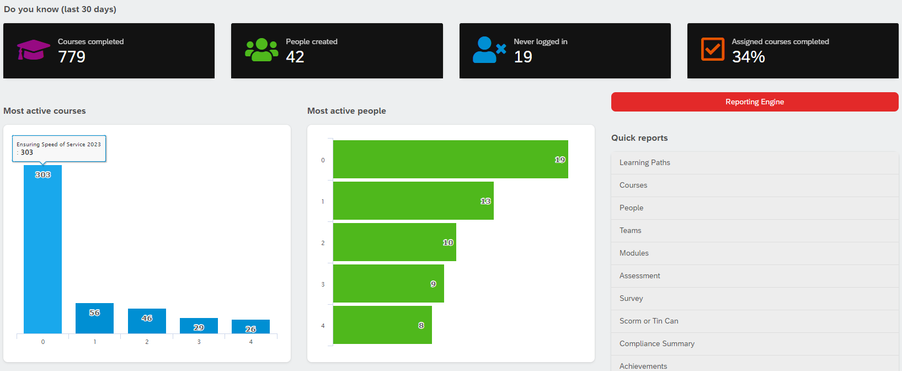

# Main Reports Page

When you click the "Reports" button on the sidebar, you'll get dropped into the Main Reports Page. Here, you'll find some at-a-glance information about the organization's training status. Among others, you'll find Courses completed, People created, login stats, as well as activity reports. 

## Accessing the Engine

To access the engine, begin by navigating to the "Reports" section on the left side of the screen. To the right, you will see a red button labeled "Reporting Engine"; click it. You will now be in the Reporting Engine proper. 

<video style="max-width: 100%" autoplay loop muted>
    <source src="navigate.webm" type="video/webm" />
    It appears your browser does not support HTML5 Video. I would recommend an upgrade. 
</video>